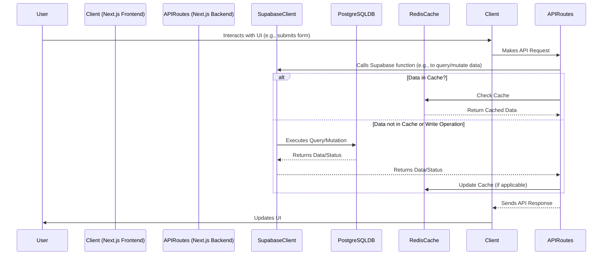

# Design Document: Zenith SaaS Project

## 1. System Architecture

### 1.1. Architecture Blueprint (Initial)

```mermaid
graph TD
    subgraph Client-Side (Next.js)
        AppDir["App Directory"]
        Components --> AppDir
        Pages --> AppDir
        Layouts --> AppDir
        PublicAssets["Public Assets"]
        TailwindCSS["Tailwind CSS"]
    end

    subgraph Server-Side
        SupabaseAPI["Supabase API"]
        SupabaseDB["Database (PostgreSQL)"] --> SupabaseAPI
        SupabaseAuth["Auth"] --> SupabaseAPI

        StripeAPI["Stripe API"]
        RedisCache["Redis Cache"]

        Middleware["Middleware"]
        AuthMiddleware["Auth Middleware"] --> Middleware
        ErrorHandlingMiddleware["Error Handling Middleware"] --> Middleware

        APIRoutes["API Routes (Next.js)"]
    end

    subgraph Infrastructure
        Vercel["Vercel Deployment"]
        EnvVars["Environment Variables"]
        Monitoring["Monitoring Tools"]
        BuildSystem["Build System (Next.js)"]
    end

    AppDir --> APIRoutes
    APIRoutes --> SupabaseAPI
    APIRoutes --> StripeAPI
    APIRoutes --> RedisCache
    AppDir --> Middleware
```

### 1.2. Component Relationship Mappings (Initial)

#### Frontend Components
*   **Auth:** `src/components/auth/` (e.g., Login, Signup, Profile forms/pages)
*   **Error Display:** `src/components/common/ErrorDisplay.tsx`
*   **Landing Page:** `src/components/sections/landing/` (and `src/app/page.tsx`)
*   **Dashboard:** `src/app/dashboard/page.tsx` (and related components in `src/components/dashboard/`)
*   **(More to be defined based on features)**

#### Backend Components (Conceptual within Next.js API Routes & Libs)
*   **Database Models/Interactions:** `src/lib/db/models/` (or directly via Supabase client)
*   **Supabase Integration:** `src/lib/supabase/` (client setup, specific queries)
*   **Stripe Integration:** `src/app/api/stripe/` (webhooks, payment intent creation, etc.)
*   **Middleware:** `src/middleware.ts` (for auth, logging, etc.)

## 2. Data Flow Visualizations

### 2.1. Initial Data Flow (User Request to Database)


## 3. API Connection Framework (Planned)

*   **Persistent Supabase Client:** Initialize in `src/lib/supabase/server.ts` (for server components/actions) and `src/lib/supabase/client.ts` (for client components).
*   **Stripe Integration:** Server-side SDK initialization for API routes (e.g., `src/app/api/stripe/callback/route.ts` or similar for handling webhooks and creating checkouts).
*   **Redis Connection Pooling:** To be implemented in `src/lib/utils/redis.ts`.
*   **Error Handling Middleware:** Centralized error handling in `src/lib/utils/errorHandler.ts` and potentially Next.js middleware.
*   **API Client for Frontend:** (To be created, e.g. using `fetch` or a library like `axios` or `SWR`/`React Query` for data fetching hooks).

## 4. Database Schema (Initial)

### 4.1. `research_projects` Table
```sql
CREATE TABLE research_projects (
    id UUID PRIMARY KEY DEFAULT gen_random_uuid(),
    user_id UUID REFERENCES auth.users(id) NOT NULL, -- Assuming Supabase Auth
    title TEXT NOT NULL,
    description TEXT,
    created_at TIMESTAMP WITH TIME ZONE DEFAULT CURRENT_TIMESTAMP,
    updated_at TIMESTAMP WITH TIME ZONE DEFAULT CURRENT_TIMESTAMP
);

-- Policies for RLS (Row Level Security) will be crucial
-- Example:
-- CREATE POLICY "Users can view their own projects."
-- ON research_projects FOR SELECT
-- USING (auth.uid() = user_id);

-- CREATE POLICY "Users can insert their own projects."
-- ON research_projects FOR INSERT
-- WITH CHECK (auth.uid() = user_id);
```
*(Further tables and relationships to be defined based on application features.)*

## 5. UI Architecture Planning

*   **UI-MCP for shadcn/ui:** (Design pending - will define component registration, state management integration).
*   **Theme Management:** Leverage `next-themes` for light/dark modes, integrated with shadcn/ui theming.
*   **Hook Implementation:** Custom React hooks for reusable logic (e.g., data fetching, form handling).

## 6. SaaS Infrastructure Planning (High-Level)

*   **Scalability:** Vercel serverless functions for backend, Supabase for scalable DB.
*   **Data Persistence:** PostgreSQL via Supabase. Redis for caching.
*   **Authentication & Authorization:** Supabase Auth, RLS policies.
*   **Multi-tenancy:** (To be designed if required - e.g., schema per tenant, or row-level tenant IDs).
*   **Monitoring & Logging:** Vercel Analytics, Supabase logs, custom logging solution.
*   **Backup & Disaster Recovery:** Supabase automated backups. Vercel infrastructure resilience.

## 7. Required Technologies & Libraries (Summary)
*   Next.js, React, TypeScript
*   Tailwind CSS, shadcn/ui, `next-themes`
*   Supabase (DB, Auth)
*   Stripe (Payments)
*   Redis (Caching)
*   (Others as identified in Research.md)

## 8. Development Milestones & Dependency Chains
(To be defined as features are fleshed out.)
